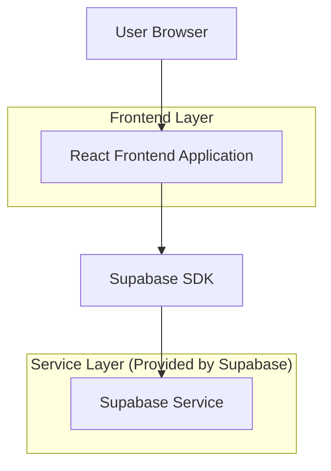
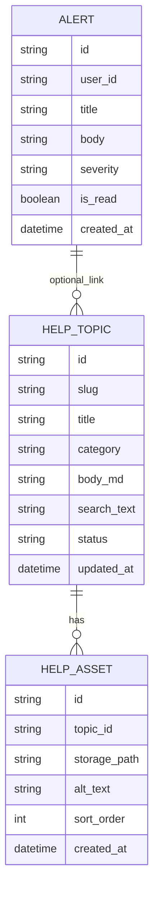

## 1.Architecture design


## 2.Technology Description
- Frontend: React@18 + tailwindcss@3 + vite
- Backend: Supabase

## 3.Route definitions
| Route | Purpose |
|-------|---------|
| / | Entrada do sistema; garante layout comum (header) com sininho e atalhos Ajuda/Sobre |
| /ajuda | Central de Manual/Ajuda completa com busca e tópicos |

## 4.API definitions (If it includes backend services)
Não há backend customizado.

## 6.Data model(if applicable)
### 6.1 Data model definition


### 6.2 Data Definition Language
Help Topics (help_topics)
```
CREATE TABLE help_topics (
  id UUID PRIMARY KEY DEFAULT gen_random_uuid(),
  slug VARCHAR(120) UNIQUE NOT NULL,
  title VARCHAR(200) NOT NULL,
  category VARCHAR(120) NOT NULL,
  body_md TEXT NOT NULL,
  search_text TEXT NOT NULL,
  status VARCHAR(20) DEFAULT 'published',
  updated_at TIMESTAMP WITH TIME ZONE DEFAULT NOW()
);

-- basic access
GRANT SELECT ON help_topics TO anon;
GRANT ALL PRIVILEGES ON help_topics TO authenticated;
```

Help Assets (help_assets)
```
CREATE TABLE help_assets (
  id UUID PRIMARY KEY DEFAULT gen_random_uuid(),
  topic_id UUID NOT NULL,
  storage_path TEXT NOT NULL,
  alt_text VARCHAR(200) DEFAULT '',
  sort_order INTEGER DEFAULT 0,
  created_at TIMESTAMP WITH TIME ZONE DEFAULT NOW()
);

CREATE INDEX idx_help_assets_topic_id ON help_assets(topic_id);

GRANT SELECT ON help_assets TO anon;
GRANT ALL PRIVILEGES ON help_assets TO authenticated;
```

Alerts (alerts)
```
CREATE TABLE alerts (
  id UUID PRIMARY KEY DEFAULT gen_random_uuid(),
  user_id UUID NOT NULL,
  title VARCHAR(200) NOT NULL,
  body TEXT NOT NULL,
  severity VARCHAR(20) DEFAULT 'info',
  is_read BOOLEAN DEFAULT FALSE,
  created_at TIMESTAMP WITH TIME ZONE DEFAULT NOW()
);

CREATE INDEX idx_alerts_user_id_created_at ON alerts(user_id, created_at DESC);

GRANT SELECT ON alerts TO anon;
GRANT ALL PRIVILEGES ON alerts TO authenticated;
```

Supabase Storage (help-images)
```
-- Bucket: help-images
-- Objetivo: armazenar prints e imagens do manual.
```
