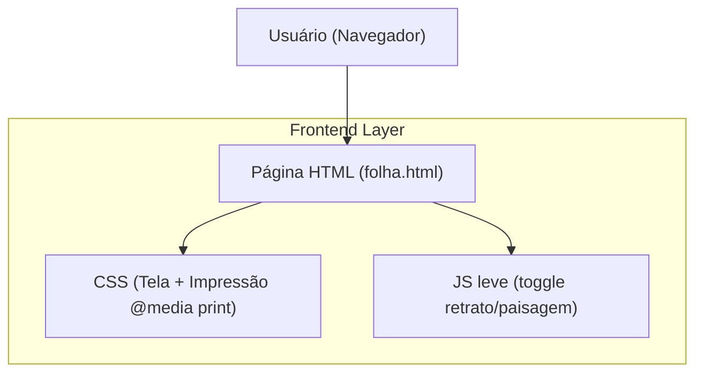

## 1.Architecture design

## 2.Technology Description
- Frontend: HTML5 + CSS3 (Flexbox/Grid + regras de impressão) + JavaScript (vanilla)
- Backend: None

## 3.Route definitions
| Route | Purpose |
|-------|---------|
| /folha/provisao-ferias (ou folha.html) | Exibir o relatório “Provisão de Férias” com layout profissional e impressão otimizada (retrato/paisagem). |

## 6.Data model(if applicable)
Não aplicável (melhoria estritamente de apresentação/layout e regras de impressão no frontend).