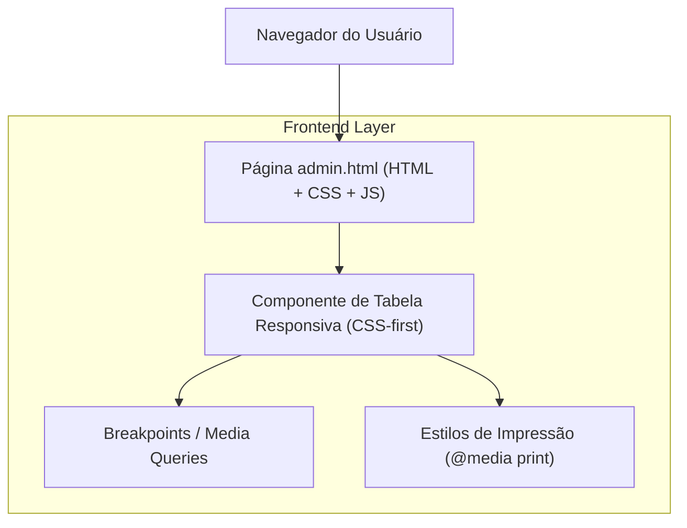

## 1.Architecture design

## 2.Technology Description
- Frontend: HTML5 + CSS3 (Flex/Grid + media queries + @media print) + JavaScript (vanilla, apenas se necessário para colapso/expansão)
- Backend: None

## 3.Route definitions
| Route | Purpose |
|-------|---------|
| /admin.html | Tela administrativa com múltiplas abas e tabelas (assinaturas, financeiro, auditorias) |

## 4.API definitions (If it includes backend services)
Não aplicável (o escopo é UI/CSS/UX das tabelas).

## 6.Data model(if applicable)
Não aplicável.

### Decisões técnicas (princípios)
- **CSS-first**: resolver overflow, larguras e impressão prioritariamente via CSS; usar JS apenas para comportamentos opcionais (ex.: expandir linha e revelar colunas ocultas).
- **Contenção por tabela**: cada tabela deve ter um container com `overflow-x: auto` (não `hidden`), evitando que o layout geral estoure.
- **Estratégia de colunas**:
  - Definir classes/atributos por coluna (ex.: `col--short`, `col--long`, `col--actions`, `data-priority`).
  - Aplicar regras por breakpoint (desktop mostra tudo; mobile oculta baixa prioridade ou transforma em layout “stacked”).
- **Impressão**: incluir `@media print` para remover controles e garantir que o `thead` seja repetido e que linhas não sejam cortadas indevidamente.
