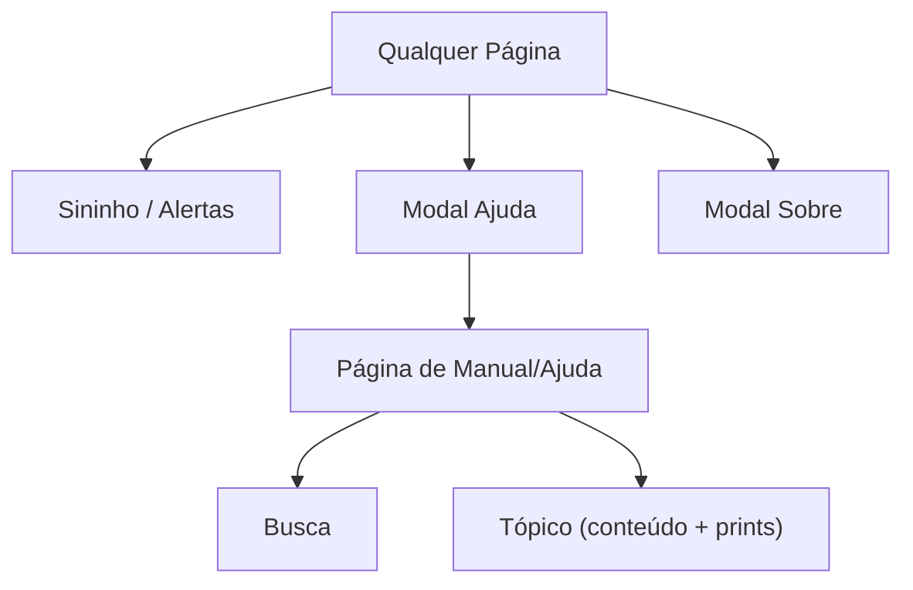

## 1. Product Overview
Criar um manual/central de ajuda completo dentro do sistema, com busca e prints, e garantir que Ajuda/Sobre e o sininho de alertas funcionem de forma consistente em todas as páginas.
O objetivo é reduzir dúvidas operacionais e padronizar o comportamento de suporte e notificações na navegação.

## 2. Core Features

### 2.1 User Roles
| Papel | Método de cadastro | Permissões principais |
|------|---------------------|-----------------------|
| Usuário do sistema | Já existente no sistema | Acessar manual/ajuda, ver alertas, abrir modais Ajuda/Sobre |
| Administrador (se aplicável) | Já existente no sistema | Mesmas permissões, além de revisar/validar conteúdo do manual (quando houver fluxo interno) |

### 2.2 Feature Module
O produto (melhoria) consiste nas seguintes páginas principais:
1. **Página de Manual/Ajuda**: busca, navegação por tópicos, conteúdo com prints.
2. **Modal Ajuda**: atalho rápido para manual e tópicos principais.
3. **Modal Sobre**: informações do sistema (versão/contato) com layout estável.

### 2.3 Page Details
| Page Name | Module Name | Feature description |
|-----------|-------------|---------------------|
| Página de Manual/Ajuda | Cabeçalho e navegação | Exibir título, breadcrumbs (se houver padrão) e acesso fácil ao início do manual. |
| Página de Manual/Ajuda | Busca | Pesquisar por termos e listar resultados relevantes; permitir limpar busca e voltar ao estado padrão. |
| Página de Manual/Ajuda | Índice de tópicos | Listar tópicos/categorias; permitir abrir um tópico; destacar tópico ativo. |
| Página de Manual/Ajuda | Conteúdo do tópico | Renderizar texto estruturado e prints (imagens) do tópico; suportar rolagem e âncoras internas quando necessário. |
| Página de Manual/Ajuda | Experiência de erro/vazio | Informar “nenhum resultado” e sugerir tópicos relacionados quando a busca não retornar itens. |
| Modal Ajuda | Abertura consistente | Abrir a partir do mesmo ponto de entrada (menu/ícone) em todas as páginas; impedir quebra de layout/scroll lock incorreto. |
| Modal Ajuda | Conteúdo rápido | Mostrar atalhos (ex.: “Como usar”, “Principais dúvidas”) e link para a Página de Manual/Ajuda. |
| Modal Sobre | Abertura consistente | Abrir corretamente em todas as páginas; garantir foco, fechamento e acessibilidade básica (ESC/overlay). |
| Modal Sobre | Informações do sistema | Exibir nome do sistema, versão (se disponível), copyright e canal de suporte/contato. |
| Todas as páginas | Sininho/Alertas (consistência) | Exibir o sininho no header (ou área padrão); abrir lista de alertas; manter comportamento idêntico (clique, fechar, navegação) em todas as páginas. |
| Todas as páginas | Estado de alertas | Indicar existência de novos alertas (badge/contador); atualizar ao abrir/ler quando aplicável. |

## 3. Core Process
Fluxo do usuário (geral):
1. Você acessa qualquer página do sistema e vê o sininho de alertas no mesmo local do layout.
2. Você clica no sininho para abrir a lista de alertas e identifica itens novos.
3. Você abre o modal de Ajuda a partir do header/atalho e navega para o Manual completo quando precisar.
4. No Manual/Ajuda, você usa a busca para localizar um assunto, abre o tópico e consulta o passo a passo com prints.
5. Você abre o modal Sobre para ver informações do sistema e contato.

