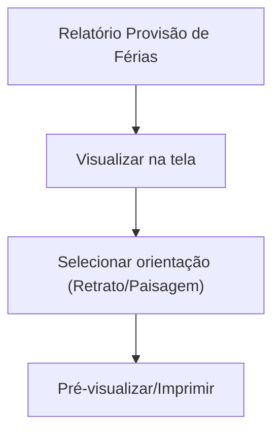

## 1. Product Overview

Melhorar o relatório “Provisão de Férias” (folha.html) para ter aparência profissional, leitura clara e impressão confiável.
O foco é evitar quebras indevidas na tabela e otimizar a impressão em modo retrato e paisagem.

## 2. Core Features

### 2.1 Feature Module

O produto (relatório) consiste nas seguintes páginas principais:

1. **Relatório Provisão de Férias**: cabeçalho profissional, corpo do relatório com tabela adaptativa sem quebras, rodapé/resumo, controles de impressão (retrato/paisagem).

### 2.3 Page Details

| Page Name                    | Module Name                      | Feature description                                                                                                                                                                    |
| ---------------------------- | -------------------------------- | -------------------------------------------------------------------------------------------------------------------------------------------------------------------------------------- |
| Relatório Provisão de Férias | Estrutura do relatório           | Exibir cabeçalho (título, empresa/unidade, período de referência), metadados do relatório (data/hora de emissão) e separação visual consistente entre seções.                          |
| Relatório Provisão de Férias | Tabela adaptativa (tela)         | Renderizar tabela com larguras estáveis e colunas alinhadas; permitir rolagem horizontal quando necessário sem “quebrar” células; manter cabeçalho da tabela visível quando aplicável. |
| Relatório Provisão de Férias | Tabela sem quebras (impressão)   | Evitar que uma linha de dados seja dividida entre páginas (não quebrar o “row”); repetir cabeçalho da tabela em cada página; garantir alinhamento consistente de números e textos.     |
| Relatório Provisão de Férias | Tipografia e formatação numérica | Aplicar hierarquia visual (títulos, subtítulos, corpo); alinhar valores monetários à direita; padronizar casas decimais e separadores conforme pt-BR.                                  |
| Relatório Provisão de Férias | Resumo/Totalização               | Exibir área de totalização/resumo (quando existente no relatório) com destaque visual e alinhamento com a tabela.                                                                      |
| Relatório Provisão de Férias | Impressão retrato/paisagem       | Permitir selecionar orientação de impressão (retrato/paisagem) e aplicar regras de CSS de impressão correspondentes (margens, escala, tamanhos).                                       |
| Relatório Provisão de Férias | Layout para impressão            | Ajustar margens, quebras de página, ocultar elementos não imprimíveis e garantir boa densidade de informação sem cortes.                                                               |

## 3. Core Process

Fluxo do usuário (visualização e impressão):

1. Você abre o relatório “Provisão de Férias” (folha.html).
2. Você confere cabeçalho, período e totalizações.
3. Você navega pela tabela (tela), com rolagem/ajuste responsivo sem quebrar o layout.
4. Você escolhe orientação de impressão (retrato ou paisagem).
5. Você imprime e valida que o cabeçalho e o cabeçalho da tabela se repetem por página e que linhas não são divididas.

