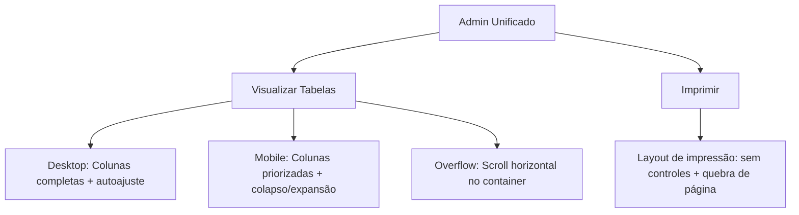

## 1. Product Overview
Melhorar todas as tabelas do `admin.html` para serem responsivas e autoajustáveis, sem “estourar” a largura do container em telas menores.
O foco é garantir boa legibilidade, uso correto de overflow, comportamento de colunas e uma impressão limpa quando aplicável.

## 2. Core Features

### 2.1 User Roles
| Papel | Método de acesso | Permissões principais |
|------|-------------------|-----------------------|
| Usuário Admin | Acesso já existente no Admin Unificado | Visualizar tabelas, filtrar, acionar botões/ações já existentes e imprimir a página |

### 2.2 Feature Module
1. **Admin Unificado**: tabelas responsivas (overflow, colunas, conteúdo longo), padrões de legibilidade, e estilos de impressão.

### 2.3 Page Details
| Page Name | Module Name | Feature description |
|-----------|-------------|---------------------|
| Admin Unificado | Contenção e overflow | Impedir estouro horizontal do layout.
- Garantir que cada tabela tenha contenção própria com rolagem horizontal quando necessário.
- Evitar `overflow: hidden` que corte conteúdo importante.
- Exibir indicador visual de scroll (quando houver) sem poluir a UI. |
| Admin Unificado | Autoajuste de colunas | Ajustar largura por conteúdo e prioridade.
- Definir estratégia de colunas: “fixas e curtas” (ex.: Status, Data, Ações) vs “flexíveis” (ex.: Email, Detalhes).
- Garantir alinhamento consistente (números à direita, datas centralizadas, texto à esquerda).
- Definir limites de largura (min/max) por tipo de coluna para evitar colunas gigantes. |
| Admin Unificado | Conteúdo longo e truncamento | Lidar com emails, CNPJ, detalhes e IDs longos.
- Aplicar truncamento com reticências quando apropriado.
- Permitir quebra de linha apenas em colunas de texto “long-form” (ex.: Detalhes).
- Garantir acesso ao valor completo (ex.: tooltip nativo via `title` ou área expansível). |
| Admin Unificado | Responsividade por breakpoint | Adaptar leitura em tablet e mobile.
- Em telas menores, reduzir densidade (padding/fonte) sem perder acessibilidade.
- Ocultar/colapsar colunas de baixa prioridade em mobile, mantendo colunas essenciais.
- Opcional: permitir expansão de linha (row details) para mostrar colunas ocultas. |
| Admin Unificado | Acessibilidade e estados | Manter usabilidade e navegação.
- Garantir contraste, foco visível, navegação por teclado e área de clique adequada.
- Preservar legibilidade do cabeçalho e evitar “saltos” de layout ao carregar dados.
- Manter estados vazios/carregando consistentes dentro do container responsivo. |
| Admin Unificado | Impressão | Gerar impressão legível e completa.
- Remover elementos não essenciais (tabs, botões, filtros) ao imprimir.
- Forçar tabela a quebrar em páginas de forma previsível (evitar corte de linhas).
- Repetir cabeçalho da tabela em cada página impressa quando possível. |

## 3. Core Process
**Fluxo do Admin (responsividade):**
1. Você abre o Admin Unificado e navega entre abas.
2. Ao visualizar uma tabela, o layout não estoura a largura: ou ela ajusta colunas ou habilita scroll horizontal no próprio container.
3. Em telas menores, colunas menos importantes são ocultadas/colapsadas e o conteúdo essencial permanece legível.
4. Ao imprimir, a página muda para um layout “print-friendly”, exibindo tabelas completas com quebra correta.

