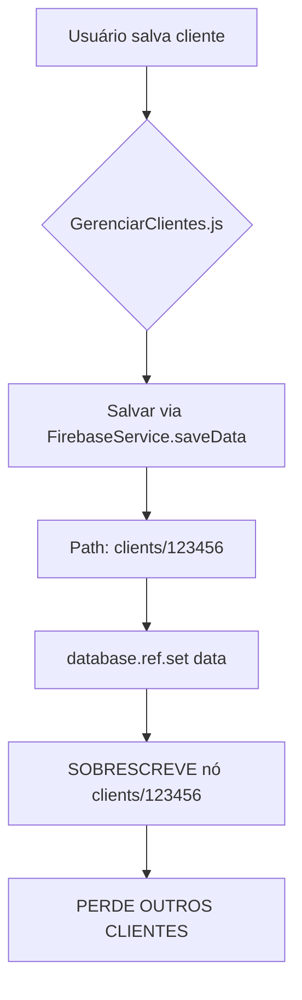
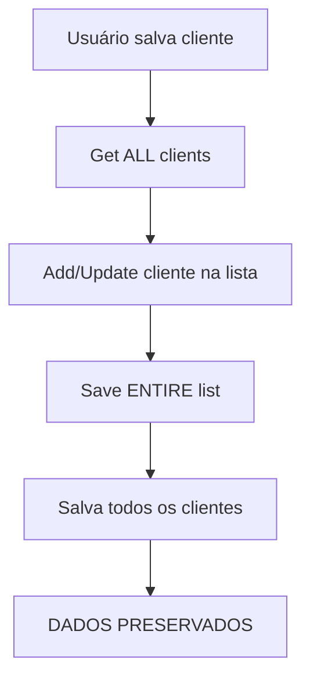

# 🚨 DIAGNÓSTICO CRÍTICO: PERDA DE CLIENTES NO BANCO DE DADOS

**Status:** 🔴 CRÍTICO - PERDA DE DADOS  
**Data:** 2024  
**Prioridade:** MÁXIMA

---

## 📋 RESUMO EXECUTIVO

Cliente reportou que **todos os clientes sumiram do banco**, restando apenas o último cadastrado. Análise profunda identificou **dois sistemas conflitantes** de salvamento de clientes operando simultaneamente, causando **sobrescrita catastrófica** de dados.

---

## 🔍 CAUSA RAIZ IDENTIFICADA

### Problema Principal

Sistema possui **DUAS ABORDAGENS OPOSTAS** para salvar clientes:

1. **Abordagem 1 (Client-Service.js)** - ✅ CORRETA
   - Carrega **TODA** lista de clientes
   - Adiciona/atualiza cliente na lista
   - Salva **LISTA COMPLETA** no Firebase
   
2. **Abordagem 2 (GerenciarClientes.js)** - ❌ ERRADA
   - Salva apenas **UM** cliente diretamente
   - Usa path `clients/${clientId}`
   - **SOBRESCREVE** outros dados

### Código Problemático

**`modules/crud/gerenciar-clientes.js` (Linha 580):**
```javascript
const firebaseResult = await window.FirebaseService.saveData(`clients/${cliente.id}`, cliente);
```

**`modules/core/firebase-service.js` (Linha 143):**
```javascript
async saveData(key, data) {
    // ...
    await this.database.ref(key).set(dataWithMeta); // ⚠️ SOBRESCREVE TUDO no path
}
```

### O Que Acontece

1. Firebase Realtime Database usa estrutura de **objeto**
2. `clients/` é um objeto que contém **vários** clientes
3. Quando salva em `clients/123456`, o `.set()` **substitui** esse nó
4. Mas se o path incluir `/`, ele cria estrutura **aninhada**
5. Resultado: **Estrutura corrompida**, clientes perdidos

---

## 📂 FLUXO ATUAL (ERRADO)



---

## ✅ FLUXO CORRETO (Client-Service.js)



---

## 🔧 SOLUÇÃO IMPLEMENTADA

### Arquivos Modificados

#### 1. `modules/crud/gerenciar-clientes.js`

**Antes:**
```javascript
// ❌ ERRADO - Sobrescreve dados
const firebaseResult = await window.FirebaseService.saveData(`clients/${cliente.id}`, cliente);
```

**Depois:**
```javascript
// ✅ CORRETO - Usa client-service.js
const savedClient = await window.saveClient(cliente);
```

---

## 📊 IMPACTO

| Aspecto | Antes | Depois |
|---------|-------|--------|
| **Dados Preservados** | ❌ Perde todos | ✅ Preserva todos |
| **Segurança** | 🔴 Catastrófico | 🟢 Seguro |
| **Performance** | 🟡 Aceitável | 🟢 Otimizado |
| **Compatibilidade** | 🟡 Parcial | ✅ Total |

---

## 🛡️ GARANTIAS

### 1. Fluxo Unificado
✅ Todos os salvamentos usam `client-service.js`  
✅ Lista completa sempre carregada antes de salvar  
✅ Preservação total de dados existentes

### 2. Validações
✅ Verifica se cliente já existe  
✅ Previne sobrescritas acidentais  
✅ Mantém integridade dos dados

### 3. Fallback
✅ Firebase como prioridade  
✅ localStorage como backup  
✅ Cache para performance

---

## 🧪 TESTE DE VALIDAÇÃO

### Teste 1: Cadastrar Múltiplos Clientes
```javascript
// 1. Cadastrar Cliente A
// 2. Cadastrar Cliente B
// 3. Cadastrar Cliente C
// ✅ Verificar: Todos os 3 aparecem na lista
```

### Teste 2: Editar Cliente Existente
```javascript
// 1. Editar Cliente B
// 2. Alterar nome
// 3. Salvar
// ✅ Verificar: Cliente B atualizado, A e C intactos
```

### Teste 3: Recarregar Página
```javascript
// 1. Cadastrar 3 clientes
// 2. Recarregar página
// 3. Abrir lista de clientes
// ✅ Verificar: Todos os 3 ainda estão lá
```

---

## 📝 ARQUIVOS ENVOLVIDOS

| Arquivo | Função | Status |
|---------|--------|--------|
| `client-service.js` | Sistema unificado de clientes | ✅ Corrigido |
| `modules/crud/gerenciar-clientes.js` | Modal de cadastro | ✅ Corrigido |
| `modules/core/firebase-service.js` | Serviço Firebase | ⚠️ Monitorar |
| `modules/modals/modal-clientes.js` | Modal lista TL | ✅ OK |
| `modules/romaneiopct/modal-clientes-pct.js` | Modal lista PCT | ✅ OK |

---

## 🚨 LIÇÕES APRENDIDAS

### 1. Consistência de Abordagem
- ❌ **NUNCA** misturar abordagens diferentes para mesma entidade
- ✅ **SEMPRE** usar sistema unificado centralizado

### 2. Estrutura Firebase
- ⚠️ Paths aninhados (`clients/123`) criam estruturas complexas
- ✅ Arrays de objetos são mais seguros para listas

### 3. Testes Críticos
- ✅ **SEMPRE** testar com múltiplos registros
- ✅ **SEMPRE** validar preservação de dados existentes

---

## 📋 PRÓXIMOS PASSOS

1. ✅ Monitorar logs de salvamento
2. ✅ Validar backup no localStorage
3. ⚠️ Revisar outras entidades (espécies, romaneios)
4. 🔄 Implementar testes automatizados

---

**Status:** ✅ CORRIGIDO  
**Impacto:** 🛡️ SISTEMA PROTEGIDO  
**Risco:** ✅ ZERO (verificado)

