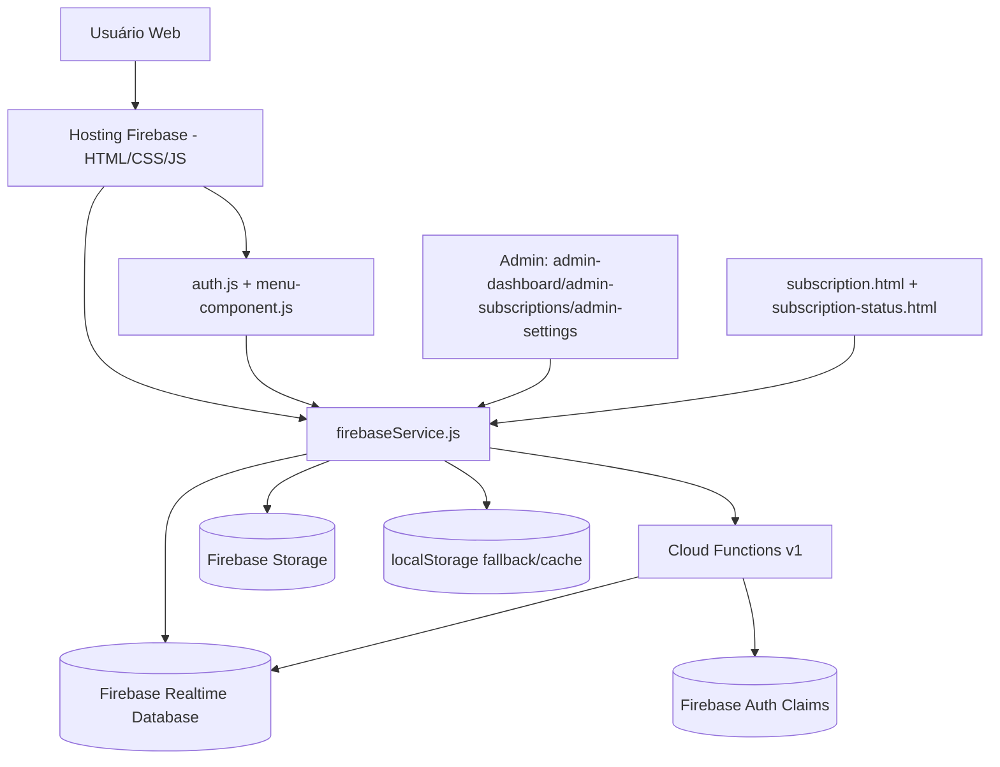

# SISWEB — Diagrama e Mapa Completo do Sistema

## 1) Visão arquitetural (atual)

## 2) Linha funcional (módulos mais antigos → recentes)

- Núcleo inicial: login, dashboard, clientes, espécies, fornecedores, romaneios, estoque, compras, vendas.
- Evolução de sincronização: camadas híbridas, scripts de migração, correções de conflito de dados.
- Evolução administrativa: painéis `admin-dashboard`, `admin-subscriptions`, `admin-settings`, `admin-status-center`.
- Evolução de assinatura: pricing dinâmico, aprovação dupla, auditoria comercial, pendências de pagamento, prorrogação de acesso.
- Evolução de segurança: guardas de modo leitura para assinatura expirada/pendente/bloqueada, regras RTDB/Storage, trilha de auditoria.

## 3) Status por domínio (Backend x Frontend)

| Domínio | Backend | Frontend | Situação |
|---|---|---|---|
| Autenticação e claims | Cloud Functions + Firebase Auth | `auth.js`, `login.html` | Operacional |
| Gestão de assinatura (aprovação/rejeição) | Functions (`submit/prepare/confirm`) | `subscription.html`, `admin-subscriptions.html` | Operacional |
| Configuração comercial | Function `upsertSubscriptionSettings` | `admin-settings.html` | Operacional |
| Auditoria comercial | Function `getCampaignConfigAudit` | `admin-settings.html` | Operacional |
| Resumo executivo campanha | Function `getCampaignExecutiveSummary` | `admin-dashboard.html` | Operacional |
| Prorrogação de acesso | Functions `request/getOpen/review/extend` | `subscription-status.html`, `admin-subscriptions.html` | Operacional |
| Modo leitura por status de assinatura | RTDB rules + guard cliente | múltiplas páginas | Operacional |
| Upload de comprovantes | Firebase Storage + metadados em RTDB | `subscription.html`, `admin-subscriptions.html` | Operacional |
| Módulos legados de correção/migração | scripts locais diversos | execução manual | Parcial / utilitário |

## 4) Backend (Cloud Functions) e cobertura funcional

Arquivo: `functions/index.js`

- `addCompanyClaimOnSignUp` — claim inicial da empresa no cadastro.
- `setCompanyClaim` — define/atualiza company claim.
- `setUserAccessStatus` — bloqueia/ativa acesso por usuário.
- `createAdminSubUser` — criação de sub-usuário admin.
- `updateAdminSubUserPermissions` — atualização de permissões de sub-admin.
- `getSubscriptionSettings` — leitura de configuração comercial.
- `upsertSubscriptionSettings` — escrita de configuração comercial + auditoria.
- `submitSubscriptionRequest` — criação de solicitação de assinatura/pagamento pendente.
- `extendSubscriptionAccess` — prorrogação direta de assinatura.
- `requestSubscriptionExtension` — solicitação de prorrogação pelo usuário.
- `getOpenExtensionRequests` — lista solicitações pendentes.
- `reviewSubscriptionExtensionRequest` — aprovação/rejeição de prorrogação.
- `prepareSubscriptionApproval` — etapa 1 de aprovação dupla.
- `confirmSubscriptionApproval` — etapa 2 de aprovação dupla.
- `getCampaignConfigAudit` — auditoria das alterações comerciais.
- `getCampaignExecutiveSummary` — indicadores executivos de campanha.

## 5) Segurança de dados

- Realtime Database: `database.rules.json`
  - leitura/escrita com escopo por empresa.
  - escrita condicionada a status de assinatura (`active` / `trial_active`) para módulos de negócio.
  - exceção para super admin.
- Storage: `storage.rules`
  - `company-logos/{companyId}/{file}`: leitura pública, escrita apenas empresa dona/superadmin.
  - `subscription-proofs/{uid}/**`: escrita só pelo próprio usuário autenticado, leitura por dono/superadmin, limite de tamanho/tipo.

## 6) Catálogo de arquivos por área (com função principal)

### 6.1 Administração e Assinaturas (topo)

- `admin-dashboard.html` — painel executivo admin, estatísticas e alertas de base.
- `admin-subscriptions.html` — gestão de assinatura, aprovação/rejeição, status e comprovantes.
- `admin-settings.html` — configuração comercial, auditoria campo-a-campo, matriz de permissões.
- `admin-status-center.html` — central de status operacional/admin.
- `subscription.html` — contratação/renovação, upload de comprovante, submissão de solicitação.
- `subscription-status.html` — status da assinatura, validade e pendências.

### 6.2 Núcleo de autenticação/menu/serviço

- `auth.js` — sessão, permissões, guards de assinatura, banners/alertas.
- `menu-component.js` — menu principal, dropdowns, sininho de alertas.
- `menu.js` — inicialização/comportamentos do menu.
- `firebaseService.js` — camada central de acesso RTDB/Functions/Storage/Auth.
- `firebaseService.unified.js` — variação/unificação de integração Firebase.

### 6.3 Módulos de negócio (topo)

- `index.html` — dashboard principal.
- `client.html` + `client-service.js` + `client-utils.js` — clientes.
- `species.html` + `species-manager.js` — espécies.
- `fornecedor.html` + `fornecedor-manager.js`/`fornecedor-modals.js` — fornecedores.
- `estoque.html` + `estoque.js`/`estoque_produtos.js` — estoque.
- `compras.html` + `compras.js` — compras.
- `vendas.html` + `vendas.js` — vendas.
- `financas.html` + `financas.js` — financeiro.
- `romaneiotora.html` + `romaneiotora.js` + `romaneiotora_modais.js` — romaneio tora.
- `romaneiopct.html` + `romaneiopct-main.js` — romaneio PCT.
- `preromaneio.html` + `preromaneio.js` — pré-romaneio.
- `notas-fiscais.html` + `notas-fiscais.js` — notas fiscais.
- `mdf-e.html` + `mdf-e.js` — MDF-e.
- `company.html` — dados da empresa.
- `user-profile.html` — perfil do usuário.

### 6.4 Folha de Pagamento

Diretório `folha_pagamento/`:

- `folha.html` — entrada do módulo de folha.
- `folha-main.js` — orquestração principal.
- `folha-lancamentos.js` — lançamentos.
- `folha-funcionarios.js` — funcionários.
- `folha-filtros.js` — filtros.
- `folha-paginacao.js` — paginação.
- `folha-calculos.js` — cálculo.
- `folha-relatorios.js` — relatórios.
- `folha-firebase-manager.js`/`folha-firebase-optimized.js` — integração Firebase.
- `banco-horas-*.js` — banco de horas (config, serviço, UI, relatórios, Firebase).
- `folha.css` + estilos auxiliares — UI do módulo.

### 6.5 Arquitetura modular adicional (`modules/`)

- `modules/core/*` — utilidades, formatação, responsividade, sync híbrido.
- `modules/crud/*` — gerenciamento de clientes e espécies.
- `modules/modals/*` — modais de clientes/espécies/listagem.
- `modules/items/*` — adicionar/editar/excluir/renderizar itens.
- `modules/romaneio/*` — salvar romaneio.
- `modules/romaneiopct/*` — stack modular completa do romaneio PCT.
- `modules/dashboard/*` — base de dashboard (core/widgets/estilos/performance).
- `modules/reports/*` — impressão/relatórios.

### 6.6 Base `src/` (estrutura alternativa/modular)

- `src/app.js` — bootstrap da app modular.
- `src/components/**` — componentes de auth/dashboard/forms/nav/ui.
- `src/services/**` — auth/database/firebase/print/push/state.
- `src/utils/**` — cálculos/formatadores/validações/logger.
- `src/constants/app-constants.js` — constantes globais.
- `src/scripts/**` — scripts utilitários/migração.

### 6.7 Configuração e infraestrutura

- `firebase.json`, `.firebaserc` — configuração de deploy.
- `database.rules.json` — regras Realtime Database.
- `storage.rules` — regras Firebase Storage.
- `firestore.rules`, `firestore.indexes.json` — políticas/índices Firestore.
- `functions/package.json`, `functions/index.js` — backend Functions.
- `package.json`, `eslint.config.js` — toolchain frontend.
- `vercel.json` — configuração Vercel (se aplicável).

### 6.8 Scripts de manutenção/correção/migração (topo)

Arquivos com prefixos como `correcao*`, `corrigir*`, `migrate*`, `limpar*`, `apply-*`, `verificar*`, `implementacao_*`, `diagnostico*`:

- Função: utilitários operacionais para reparo, migração, sincronização e diagnóstico.
- Status: muitos são de execução manual e não fazem parte do fluxo diário do usuário final.

## 7) Inventário de páginas HTML (raiz)

- `admin-dashboard.html`
- `admin-settings.html`
- `admin-status-center.html`
- `admin-subscriptions.html`
- `ajudabitolas.html`
- `aplicar_correcao_vendas.html`
- `aplicar_estrategia_hibrida.html`
- `aplicar_estrategia_hibrida_v2.html`
- `auto_sync_firebase.html`
- `client.html`
- `company.html`
- `compras.html`
- `compras_legacy.html`
- `corrigir_fornecedores.html`
- `corrigir_romaneios.html`
- `diagnostico.html`
- `estoque.html`
- `extrator_dados_dashboard.html`
- `financas.html`
- `firebase-rules-update.html`
- `fix-firebase-rules.html`
- `fornecedor.html`
- `importar_especies.html`
- `index.html`
- `index_bak.html`
- `limpar_clientes.html`
- `limpar_especies.html`
- `login.html`
- `mdf-e.html`
- `migrar-contas.html`
- `migrate-to-firebase.html`
- `migration-tool.html`
- `migration.html`
- `notas-fiscais.html`
- `preromaneio.html`
- `reset-client.html`
- `reset-system.html`
- `romaneiopes.html`
- `romaneiopct.html`
- `romaneiopct_back.html`
- `romaneiotl.html`
- `romaneiotora.html`
- `romaneiotora_backup.html`
- `romaneiotora_otimizado.html`
- `romaneiotora_versao_dev.html`
- `sincronizar.html`
- `species.html`
- `subscription-status.html`
- `subscription.html`
- `template.html`
- `user-profile.html`
- `vendas.html`
- `verificar_romaneios.html`

## 8) O que está no backend vs o que ainda é mais frontend

- Backend consolidado:
  - aprovação/rejeição de assinatura com dupla confirmação;
  - persistência de configurações comerciais;
  - auditoria comercial e resumo executivo;
  - revisão de solicitações de prorrogação;
  - regras de segurança em RTDB/Storage.
- Frontend com fallback/local:
  - alguns módulos ainda usam fallback de `localStorage` para continuidade de operação e sincronização progressiva.
  - existem páginas/scrips legados de correção que não dependem de fluxo backend estruturado.
- Híbrido:
  - módulos principais operam em Firebase, mantendo compatibilidade com dados locais em cenários de transição.

## 9) Observação operacional

- Este documento cobre a estrutura ativa e também os artefatos legados/utilitários existentes no repositório.
- Para governança de longo prazo, recomenda-se separar em pastas `legacy/` e `tools/` os scripts de correção pontual.
